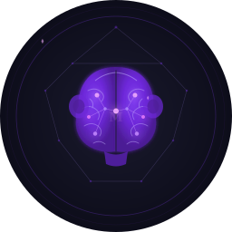

<!-- OpenGraph / social card meta for GitHub link previews -->
<!--
  og:title: Monkey Mind — Your AI tools forget you. This fixes that.
  og:description: Open-source, self-hosted personal context library. Give Claude, Cursor, and ChatGPT a persistent memory of who you are, what you've built, and what matters to you.
  og:image: https://raw.githubusercontent.com/jungleboyz/monkey-mind-oss/main/assets/logo-512.png
  og:url: https://github.com/jungleboyz/monkey-mind-oss
  twitter:card: summary_large_image
-->

<p align="center">
  
</p>

<h1 align="center">Monkey Mind</h1>

<p align="center">
  <strong>Your AI tools forget you. This fixes that.</strong>
</p>

<p align="center">
  <a href="https://github.com/jungleboyz/monkey-mind-oss/blob/main/LICENSE"></a>
  <a href="https://github.com/jungleboyz/monkey-mind-oss/actions"></a>
  
  
</p>

---

Every conversation, Claude forgets you. Every new Cursor session, you re-explain the project. Every ChatGPT window, you paste the same stale context blob and hope for the best.

**Monkey Mind is a persistent, structured memory for your AI tools** — self-hosted, open source, works with any LLM. It ingests your notes, GitHub repos, and documents, then serves that context to Claude, Cursor, or any MCP-compatible tool. Cross-domain synthesis. Source provenance. Staleness detection. No cloud dependency. Your data never leaves your machine.

```bash
# What your AI can answer once Monkey Mind is running:
"What should I focus on this week?"
"What are my most active projects right now?"
"What did I decide about the authentication approach?"
"Am I on track with my health goals?"
```

Cross-domain answers. Traced to sources. No hallucination.

---

## Quickstart

**Prerequisites:** Docker + Docker Compose. OpenAI API key (embeddings). Anthropic or OpenAI key (synthesis).

```bash
# 1. Clone and configure
git clone https://github.com/jungleboyz/monkey-mind-oss.git
cd monkey-mind-oss
cp .env.example .env
# Edit .env — add OPENAI_API_KEY and ANTHROPIC_API_KEY

# 2. Start
docker compose up -d

# 3. Create your user (API key shown once — save it)
docker compose exec api monkey-mind user create yourname

# 4. Point it at your notes
docker compose exec api monkey-mind ingest --connector files --user yourname

# 5. Query
curl -X POST http://localhost:8000/query \
  -H "Authorization: Bearer mm_sk_..." \
  -H "Content-Type: application/json" \
  -d '{"query": "What should I focus on this week?"}'
```

That's it. Full setup guide: **[docs/quickstart.md](docs/quickstart.md)**

---

## Why it works

| The problem | What Monkey Mind does |
|------------|----------------------|
| AI tools forget you every conversation | Persists your context across all tools, forever |
| Context scattered across notes, repos, files | One structured library, multiple sources |
| You paste the same stale blob every time | Staleness detection flags outdated content automatically |
| AI hallucinates answers about you | Every response traced to a source document |
| Locked to one AI provider | Works with OpenAI, Anthropic, Ollama — swap any time |
| Your data in someone else's cloud | Fully self-hosted. Your machine, your data. |

**In one line:** Google Personal Intelligence, but open source, self-hosted, and it actually works today.

---

## Features

- **Domain-structured context** — 6 life domains out of the box (health, professional, personal, strategic, temporal, projects). Add your own.
- **Two-tier retrieval** — summary + detail embeddings for fast, precise answers
- **Cross-domain synthesis** — a single query draws from health, work, and calendar simultaneously
- **Provenance tracking** — every fact points back to the source file
- **Staleness detection** — configurable per domain; stale sources flagged in responses
- **Knowledge boundary** — says "I don't know" instead of inventing an answer
- **MCP server** — connects to Claude Desktop, Cursor, and any MCP-compatible tool
- **REST API** — documented, authenticated, OpenAPI spec at `/docs`
- **Pluggable connectors** — `files` and `github` built-in; build your own
- **Self-hosted** — your data never leaves your machine
- **Model-agnostic** — bring your own keys for OpenAI, Anthropic, or Ollama

---

## Connectors

| Connector | Status | What it ingests |
|-----------|--------|----------------|
| **files** | ✅ Built-in | Markdown, text, PDF from any local directory |
| **github** | ✅ Built-in | Profile, repos, READMEs, contribution patterns |
| Obsidian | 🔜 Phase 2 | Vault notes and links |
| Gmail | 🔜 Phase 2 | Email threads (OAuth) |
| Community | 🤝 Build one | See [connector dev guide](docs/connector-dev-guide.md) |

---

## MCP integration (Claude Desktop / Cursor)

Add to `~/Library/Application Support/Claude/claude_desktop_config.json`:

```json
{
  "mcpServers": {
    "monkey-mind": {
      "command": "python",
      "args": ["-m", "mm.mcp.server"],
      "env": {
        "USER_ID": "yourname",
        "DATA_ROOT": "/Users/yourname/.monkey-mind"
      }
    }
  }
}
```

Then ask Claude: *"What should I focus on this week?"* — and it will draw from your health, work, and strategic domains simultaneously.

---

## CLI reference

```bash
monkey-mind setup                          # Interactive setup wizard
monkey-mind user create <name>             # Create user + generate API key
monkey-mind ingest --connector files       # Ingest from file connector
monkey-mind ingest --connector github      # Ingest from GitHub connector
monkey-mind eval                           # Run quality eval suite (9 scenarios)
monkey-mind domain add <id> <label>        # Add a domain
monkey-mind domain rename <id> <label>     # Rename a domain
monkey-mind domain remove <id>             # Remove a domain
monkey-mind user delete <name> --confirm   # Delete all user data
```

---

## Architecture

```
Source (files / GitHub)
  → Connector → ConnectorPage
  → Two-tier embedding (summary + detail)
  → ChromaDB (per-user collection)
  → REST API / MCP server
  → Claude, Cursor, ChatGPT, or any tool
```

Full technical design: **[docs/architecture.md](docs/architecture.md)**

---

## Contributing

Apache 2.0. Contributions welcome.

**Best first contribution:** Build a connector. The interface is clean and documented — 200 lines, one class to implement.

```bash
git clone https://github.com/jungleboyz/monkey-mind-oss.git
cd monkey-mind-oss
pip install -e ".[dev]"
python -m pytest tests/ -v
```

See [docs/connector-dev-guide.md](docs/connector-dev-guide.md) to get started.

---

## License

[Apache 2.0](LICENSE)

---

<p align="center">
  
  <br/>
  <sub>Context is the moat.</sub>
</p>
